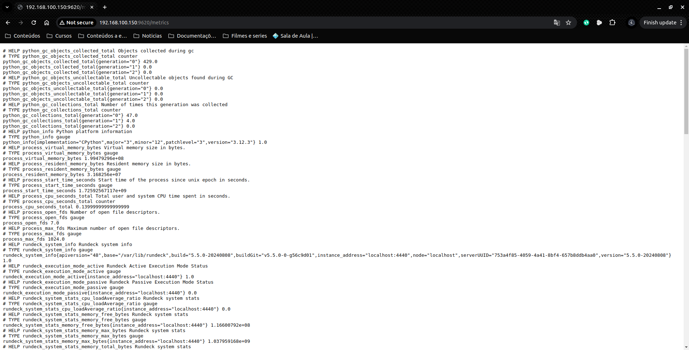

# Configuração do rundeck exporter (Execute os comandos como root)

## 1 - Acesse o diretório /opt
```bash
cd /opt
```

### 2 - Clone o repositório:
```bash
git clone https://github.com/phsmith/rundeck_exporter.git
```

### 3 - Acesse o diretório:
```bash
cd rundeck_exporter
```

### 4 - Crie uma venv e ativando o ambiente virtual
```bash
python3 -m venv .venv
source .venv/bin/activate
```

### 5 - Instale a lib do prometheues
```bash
pip install prometheus-client requests cachetools
```

## 6 - Gere um token no Rundeck
Para que o `rundeck_exporter` possa coletar métricas, você precisa de um token de API:

1. Acesse o Rundeck com uma conta de administrador.
2. No canto superior direito, clique no seu nome de usuário para abrir o menu suspenso.
3. Selecione a opção **Profile** (Perfil).
4. Dentro da página do perfil, você verá a seção **User API Tokens**.
5. Clique no botão **Generate New Token** (Gerar Novo Token).
6. Dê um nome ou descrição ao token e defina a sua validade (opcional).
7. Clique em **Save** (Salvar).


### 7 - Criar uma acl para permitir o usuário nomeado exporter para obter métricas bem como execução de métricas para qualquer projeto:
```bash
  by:
    username: exporter
  description: system:read
  for:
    resource:
    - allow:
      - read
      equals:
        kind: system
  context:
    application: rundeck
---
by:
  username: exporter
description: project:read
for:
  project:
  - allow:
    - read
    match:
      name: .*
context:
  application: rundeck
---
by:
  username: exporter
description: events:read
for:
  resource:
  - allow:
    - read
    equals:
      kind: event
  job:
  - allow:
    - read
    - view
context:
  project: .*
---
by:
  username: exporter
description: Allow [read] for node
for:
  node:
  - allow:
    - read
    match:
      nodename: .*
context:
  project: .*

---
by:
  username: exporter
description: Allow [read] for (All) node
for:
  resource:
  - allow:
    - read
    equals:
      kind: node
context:
  project: .*
```

### 8 - Execute o comando para testar o rundeck exporter, caso tenha mais projetos insira-os no campo filter separado por virgula:
```bash
RUNDECK_TOKEN=INSIRA-SEU-TOKEN /opt/rundeck_exporter/rundeck_exporter.py --host=0.0.0.0 --rundeck.url=http://localhost:4440 --rundeck.skip_ssl --rundeck.cpu.stats --rundeck.memory.stats --rundeck.projects.executions --rundeck.projects.executions.filter=5n --rundeck.requests.timeout=10
```
 
### 9 - Crie um serviço no systemd para que o serviço possa ser inicializado junto com o sistema:
```bash
cat << EOF > /etc/systemd/system/rundeck_exporter.service
[Unit]
Description=Rundeck Exporter
After=network.target

[Service]
User=rundeck
Group=rundeck
WorkingDirectory=/opt/rundeck_exporter
Environment="RUNDECK_TOKEN=INSIRA-SEU-TOKEN"

# Use o caminho completo para o bash e certifique-se de que o ambiente virtual é ativado
ExecStart=/bin/bash -c '/opt/rundeck_exporter/.venv/bin/python3 /opt/rundeck_exporter/rundeck_exporter.py --host=0.0.0.0 --rundeck.url=http://localhost:4440 --rundeck.skip_ssl --rundeck.cpu.stats --rundeck.memory.stats --rundeck.projects.executions --rundeck.projects.executions.filter=5n --rundeck.requests.timeout=10'

Restart=always
RestartSec=5

[Install]
WantedBy=multi-user.target
EOF
```

### 10 - Atribua permissão:
```bash
chmod 644 /etc/systemd/system/rundeck_exporter.service
```

### 11 - Recarregue o systemd e habilite o serviço: Para ativar o serviço para inicialização no boot, recarregue o systemd e habilite o novo serviço:
```bash
sudo systemctl daemon-reload
sudo systemctl enable rundeck_exporter.service
```

### 12 - Verifique o status do serviço rundeck_exporter.service
```bash
systemctl status rundeck_exporter.service
```

### 13 - Acesse a url IP do rundeck com a porta e path:
```bash
localhost:9620/metrics
```


